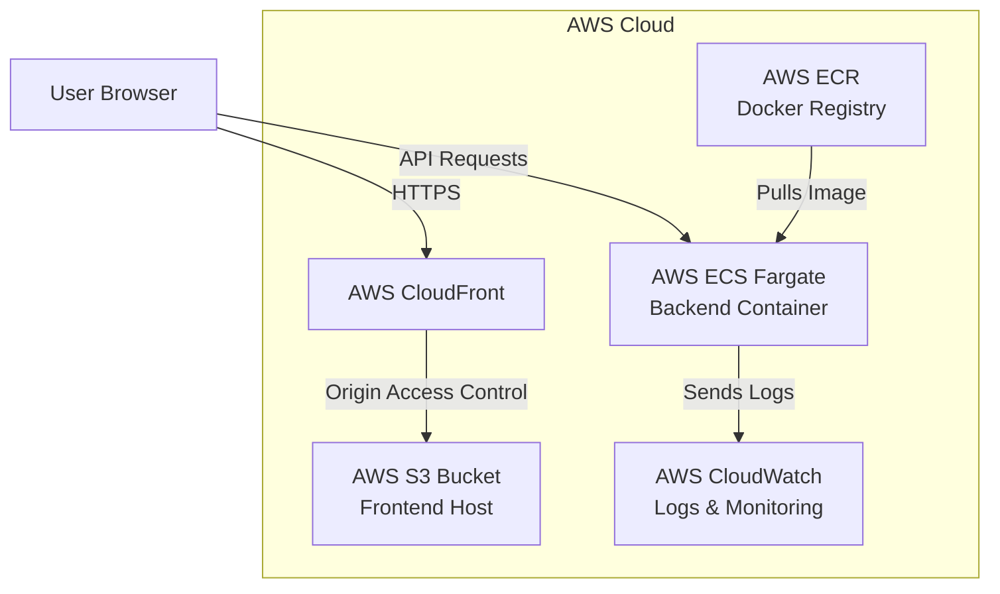

# Instructions

1. Use MongoDB for database storage implementation
1. Use Mongoose for ORM
1. Implement at least one full CRUD RESTful API
1. Deploy it on Render for backend and vercel for frontend
1. Resolve CORS issue if needed after deployment

## Explanation

## Architecture



The application is deployed entirely on AWS:
- **Frontend**: Hosted on **AWS S3** and served via **AWS CloudFront** (CDN) for performance and HTTPS termination.
- **Backend**: Containerized via Docker, stored in **AWS ECR**, and deployed to **AWS ECS Fargate** as a serverless container.
- **Monitoring**: Application logs are automatically shipped to **Amazon CloudWatch** for observability and monitoring.

### Deployed Application
- **URL**: [https://d1234567890.cloudfront.net](https://d1234567890.cloudfront.net) *(Placeholder)*
- **API Endpoint**: [http://<ecs-public-ip>:5001/api](http://<ecs-public-ip>:5001/api) *(Placeholder)*

## CI/CD Pipeline

We strictly enforce the following workflow order in our GitHub Actions pipeline:

1. **CI (Tests)**: On push/PR to `main`, the pipeline sets up Node.js, runs client/server linters, and executes unit/integration tests. Test reports (JUnit) and coverage artifacts are generated and uploaded.
2. **Terraform Apply**: If tests pass, HashiCorp Terraform initializes, plans, and automatically applies the infrastructure (S3, CloudFront, ECR, ECS, IAM, Security Groups). S3 buckets are configured with **versioning enabled**, **AES256 encryption**, and **public access blocked**.
3. **Docker Build & Push**: The backend application is built using a **multi-stage Dockerfile** (running as a **non-root user** with a **healthcheck**) and pushed to the newly provisioned Amazon ECR repository.
4. **ECS Deploy**: The frontend is synced to the S3 bucket and CloudFront cache is invalidated. The backend ECS Service is updated to run the latest Docker image. The pipeline concludes by running `aws ecs describe-services` to verify the service is successfully running and active.

### Screenshots

**GitHub Actions Pipeline Success**
*(Insert Screenshot Here)*

**AWS ECS Service Running**
*(Insert Screenshot Here)*

**AWS S3 Configuration (Encryption, Versioning)**
*(Insert Screenshot Here)*

### Local Development & Testing

To run the application locally or execute tests, use the following commands:

**Client (Frontend)**
```bash
cd client
npm install
npm run dev      # Start local development server
npm test         # Run unit tests via Vitest
npm run lint     # Run ESLint
```

**Server (Backend)**
```bash
cd server
npm install
npm run dev      # Start local backend with nodemon
npm test         # Run unit & integration tests via Jest
npm run lint     # Run ESLint
```

### Design Decisions
- **Express + Mongoose**: Used for rapid prototyping and flexibility, switching from SQLite to MongoDB to suit database requirements.
- **Premium UI**: Leveraged standard modern CSS with variables and hover states rather than a heavy component library to keep the frontend bundle small and the UI bespoke.
- **Cypress E2E Testing**: Added to simulate real user flows, verifying the integration from the browser down to the database level.
- **Infrastructure as Code**: Switched to Terraform for AWS infrastructure to maintain a reproducible and scalable cloud environment.

### Challenges
- **Test Automation with Mongoose**: Setting up `mongodb-memory-server` required handling `mongoose.connection` carefully to avoid overlapping connection pools during automated Jest testing.
- **AWS Deployment**: Re-architecting the deployment from manual EC2 setups to an automated ECS/Fargate containerized deployment required strict management of CI/CD steps and Terraform state.
